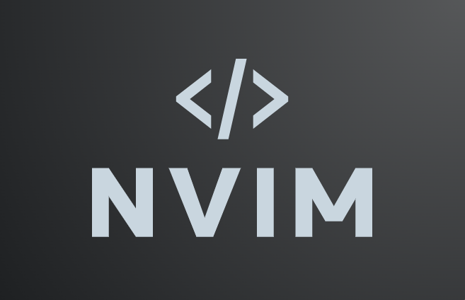
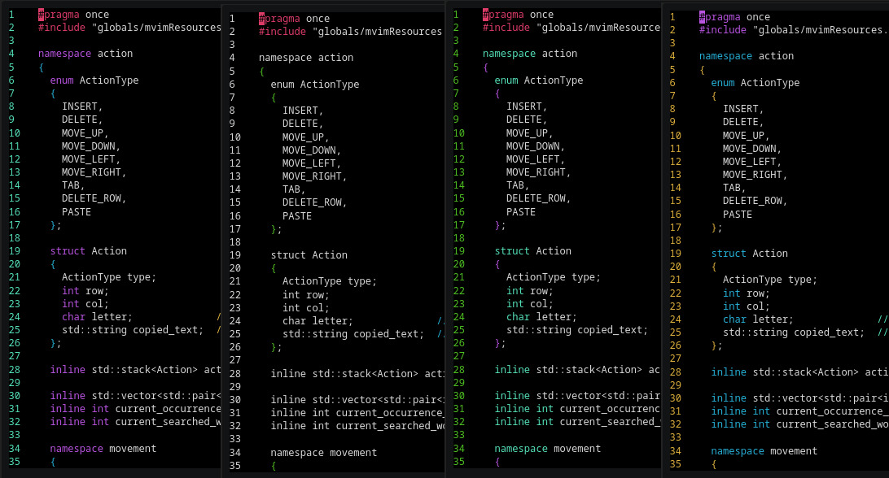

# 

[](https://img.shields.io/badge/VIM-%2311AB00.svg?style=plastic&logo=vim&logoColor=white)
[](https://img.shields.io/badge/c++-%2300599C.svg?style=plastic&logo=c%2B%2B&logoColor=white)
[](https://img.shields.io/badge/Linux-FCC624?style=plastic&logo=linux&logoColor=black)

mvim is a VIM inspired modal-based text editor written in Cpp using the [ncurses](https://opensource.apple.com/source/old_ncurses/old_ncurses-1/ncurses/test/ncurses.c.auto.html) library.
If you find a bug or want to discuss the best way to add a new feature, please
[open an issue](https://github.com/ErikDervishi03/mvim-textEditor/issues/new/choose).

## Demo
[](https://asciinema.org/a/2cxeDudipJMdx0PSHeL8FVybe)

## Customizable ColorSchemes
You can easily customize the color schemes in mvim to suit your preferences:



## Quick Start
mvim has the following dependencies:
- [GCC](https://gcc.gnu.org/)
- [Cmake](https://cmake.org/)
- [ncurses](https://opensource.apple.com/source/old_ncurses/old_ncurses-1/ncurses/test/ncurses.c.auto.html)

you can install them with:
```sh
  chmod +x install_dependencies.sh && ./install_dependencies.sh
```
## install mvim
option 1:
```sh
  git clone https://github.com/ErikDervishi03/mvim-textEditor.git
  cd mvim-textEditor
  mkdir build
  cd build
  cmake ..
  sudo make install
```
option 2 use [sget](https://github.com/d99kris/sget):
```sh
  sudo sget install https://github.com/ErikDervishi03/mvim-textEditor.git
```
or uninstall with:
```sh
  sudo xargs rm < install_manifest.txt
```
## Modes
Normal - For motions and deletion \
Insert - For inserting text \
Find -   For search/replace text in the current buffer 

## Keybinds
|Mode  | Keybind        | Action                                          |
|------|----------------|-------------------------------------------------|
|Insert| Esc            | change to Normal mode                           |
|Normal| q              | quit                                            |
|Normal| s              | save                                            |
|Normal| h              | Move cursor left                                |
|Normal| j              | Move cursor down                                |
|Normal| k              | Move cursor up                                  |
|Normal| l              | Move cursor right                               |
|Normal| x              | Delete character                                |
|Normal| i              | Enter insert mode                               |
|Normal| v              | Enter visual mode                               |
|Normal| f              | Enter find mode                                 |
|Normal| g              | Go to first line                                |
|Normal| G              | Go to last line                                 |
|Normal| o              | Create line below current                       |
|Normal| O              | Create line above current                       |
|Normal| m              | open a menu that explain keys                   |
|Normal| a              | go to the end of the line                       |
|Normal| A              | go to the beginning of the line                 |
|Normal| d              | remove the line                                 |
|Normal| e              | Open file explorer                              |
|Normal| p              | paste                                           |

## Visual
Visual mode works the same as Normal mode, except it works on the entire selection, instead of character by character.
You can use all Movement combination available in normal mode
| Keybind        | Action                                          |
|----------------|-------------------------------------------------|
| >              | Indent current selection                        |
| <              | Unindent current selection                      |
| esc            | return to normal mode                           |

## Search
Search mode takes a string and finds it in the file.
| Keybind        | Action                                          |
|----------------|-------------------------------------------------|
| n              | Go to the next occurence of the searched word   |
| N              |Go to the previous occurence of the searched word|
| r              | replace                                         |
| esc            | return to normal mode                           |

## usage
1. create a new file
```sh
  mvim
```

2. open an existing file
```sh
  mvim filename
```

## Technical Details

mvim uses [doxygenmd](https://github.com/d99kris/doxygenmd) to generate
its Markdown API documentation:

    doxygenmd src doc

mvim uses Uncrustify to ensure consistent code formatting:

    uncrustify -c uncrustify.cfg --no-backup src/*
    uncrustify -c uncrustify.cfg --no-backup include/*

## inspiration
- [vim](https://github.com/vim/vim)
- [Cano](https://github.com/CobbCoding1/Cano?tab=readme-ov-file) for this README
